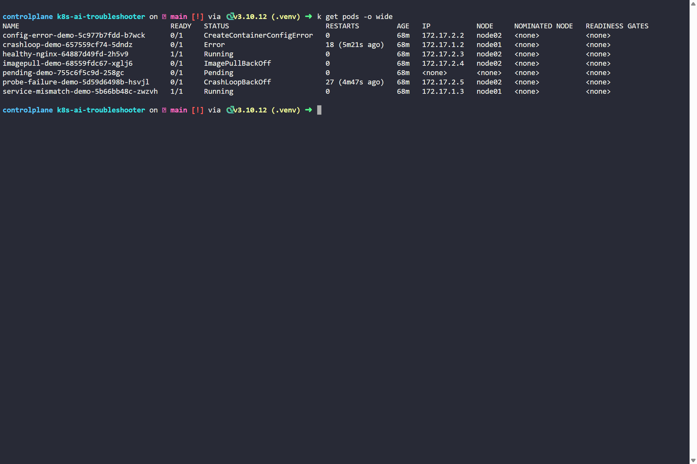
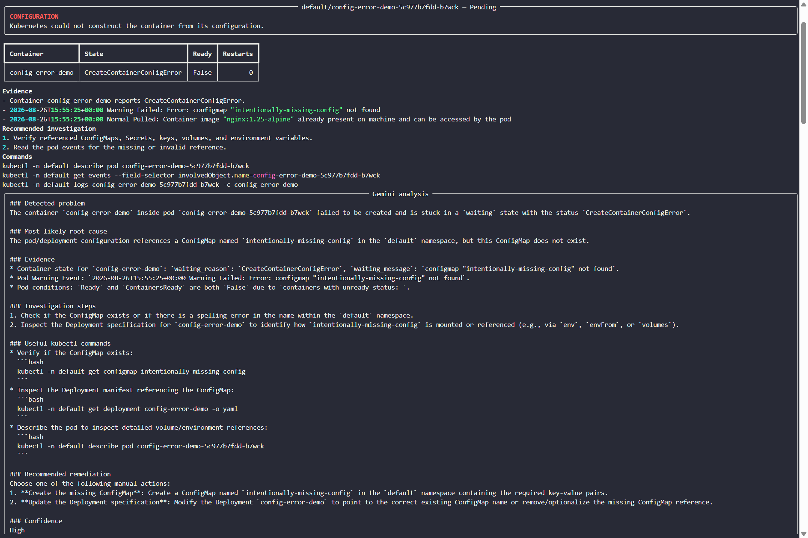
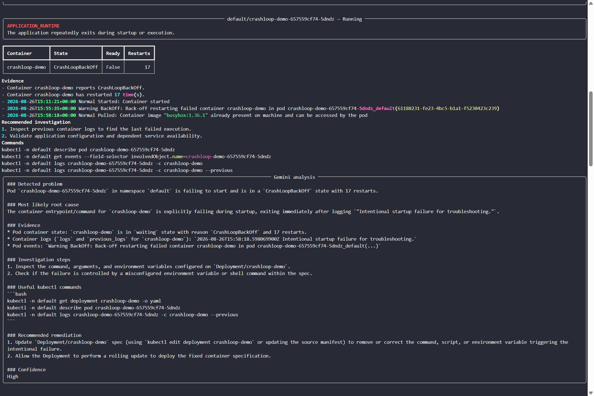
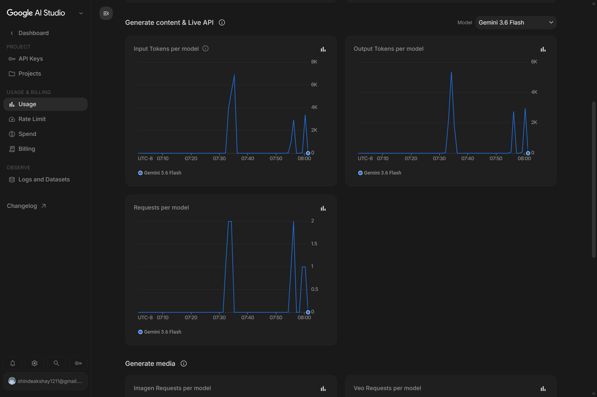

# Kubernetes AI-Powered Cluster Troubleshooter

A read-only Python CLI for diagnosing unhealthy Kubernetes pods with Google
Gemini. It discovers explicit pod failure signals, gathers focused API evidence,
applies deterministic Kubernetes rules, and sends the bounded evidence to Gemini
for root-cause analysis and manual remediation guidance.

## What it does

1. Authenticates with local kubeconfig or an in-cluster ServiceAccount.
2. Finds pods with concrete failure signals such as `CrashLoopBackOff`, image
   pull errors, unschedulable Pending state, `OOMKilled`, configuration errors,
   and excessive restarts.
3. Collects pod conditions, container state, recent events, current logs, and
   previous logs for restarted containers.
4. Runs deterministic rules to classify Kubernetes signals for the terminal
   display.
5. Sends only bounded, structured Kubernetes evidence to Gemini. Gemini
   generates the investigation steps, commands, root-cause guidance, and
   manual remediation suggestions. The
   tool never modifies Kubernetes resources.

## Quick start

```bash
git clone https://github.com/akshayshinde1211/k8s-ai-troubleshooter.git
cd k8s-ai-troubleshooter
python3 -m venv .venv
source .venv/bin/activate
pip install -r requirements.txt
cp .env.example .env
# Set GEMINI_API_KEY in .env
python main.py check-connectivity
python main.py scan
```

Limit scanning to one namespace when appropriate:

```bash
python main.py scan --namespace default
```

The CLI loads the current kubeconfig first. When it runs in Kubernetes, it falls
back to in-cluster ServiceAccount authentication.

## Demo

The tool scans a cluster containing unhealthy workloads and reports the
Kubernetes evidence used for each diagnosis.



For a configuration failure, the CLI surfaces the failed pod state and the
relevant Kubernetes event. Gemini then explains the missing ConfigMap reference,
provides investigation commands, and recommends a manual remediation.



The same evidence-driven workflow diagnoses a CrashLoopBackOff workload and
uses the container state, restart count, events, and logs to explain the likely
startup failure.



The Gemini API usage dashboard confirms requests made by the CLI through
Gemini 3.6 Flash.



## Test with the lab

Create controlled failures using the separate lab repository:

```bash
git clone https://github.com/akshayshinde1211/k8s-troubleshooting-lab.git
cd k8s-troubleshooting-lab/labs
kubectl apply -f .
cd ../../k8s-ai-troubleshooter
python main.py scan
```

Expected deterministic categories include `APPLICATION_RUNTIME`, `IMAGE`, and
`SCHEDULING`.

## Gemini configuration

`GEMINI_API_KEY` is required for every `scan` command. Copy `.env.example` to
`.env` and set the API key:

```bash
python main.py scan --namespace default
```

The default model is `gemini-3.6-flash`; use `--model` to select a different
Gemini model. Only bounded pod evidence is
sent: relevant status, configured images, resource requests, conditions, recent
events, and truncated logs. Python-generated classifications, investigation
steps, commands, and remediation suggestions are not sent. The prompt
prohibits the model from inventing evidence or claiming that it applied
remediation.

## Read-only safety model

The CLI only reads Kubernetes information. It never deletes pods, patches
workloads, scales deployments, executes commands in containers, or changes
ConfigMaps and Secrets. Gemini identifies the likely cause and recommended
remediation; an operator reviews and applies the change.

## In-cluster RBAC

The `manifests/` directory provides namespace-scoped RBAC:

- `pods`, `events`: list and get troubleshooting signals
- `pods/log`: read current and previous container logs
- `replicasets`, `deployments`: resolve owner context

Apply the manifests to the namespace being inspected:

```bash
kubectl apply -f manifests/serviceaccount.yaml
kubectl apply -f manifests/role.yaml
kubectl apply -f manifests/rolebinding.yaml
```

To run it in Kubernetes, build and publish an image, replace the placeholder
image in `manifests/deployment.yaml`, then apply the deployment manifest. No API
key is baked into the image; provide `GEMINI_API_KEY` through your secret
management process for every scan.

## Container image

```bash
docker build -t k8s-ai-troubleshooter:local .
docker run --rm --env-file .env -v "$HOME/.kube:/home/app/.kube:ro" \
  k8s-ai-troubleshooter:local scan
```

The image runs as a non-root user. For a local kubeconfig mount, ensure the
mounted file is readable by the container user or use an in-cluster deployment.

## Tests

```bash
pytest
```

The tests cover the deterministic category mapping independently of a live
cluster.

## Design choices

- The Kubernetes Python client provides typed API access and avoids fragile
  parsing of `kubectl` output.
- Pod phase and container state are evaluated separately: a `Running` pod can
  still be unhealthy when a container is not ready or restarting.
- Previous logs matter because the container that failed may no longer be the
  currently running instance.
- Rules run locally to classify Kubernetes signals for the terminal display;
  Gemini receives only the collected Kubernetes evidence.
- The failure lab remains separate so test failures are reproducible without
  coupling application code to Kubernetes manifests.
